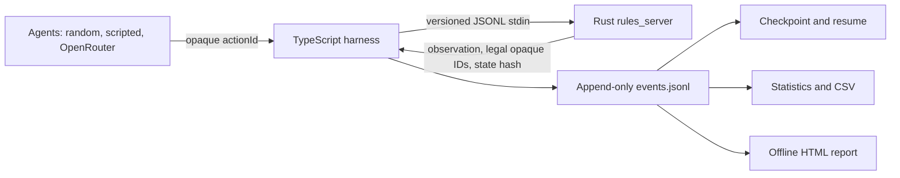

# LOTR Duel Evaluation Harness

This project runs reproducible LLM and baseline-agent evaluations against the
Lord of the Rings Duel rules engine. TypeScript owns orchestration, providers,
audit logs, recovery, statistics, and reporting; Rust owns game rules, legal
actions, hidden information, and every state transition. That split is
intentional: an evaluator must never reimplement or second-guess game legality.

Its strongest engineering features are a versioned JSONL protocol boundary,
opaque server-issued action IDs, durable append-only events, deterministic
seat-swapped scheduling, checkpointed resume, provider retries/budgets, and
offline reports derived from the audit trail.

## Quick Start

Requirements: Node.js 22+, npm, and a local Rust engine checkout. From this
repository, the sibling checkout is commonly `../7wonders-duel-lotr-rules-engine`.

```sh
npm ci

# One local random-vs-random game. No API key or network request is used.
npm run harness -- tournament --model random --opponent-model random \
  --master-seed 42 --games-per-pairing 1 --no-seat-swaps \
  --server-cwd ../7wonders-duel-lotr-rules-engine --output runs/random-one

# Deterministic scripted/local baseline.
npm run harness -- tournament --model first-legal --opponent-model first-legal \
  --master-seed 42 --games-per-pairing 2 \
  --server-cwd ../7wonders-duel-lotr-rules-engine --output runs/local-baseline
```

`random` uses seeded local RNGs. `first-legal` is a deterministic local smoke
agent. Neither exposes an API credential.

## OpenRouter

Copy the example environment file and set the key only in your local ignored
file:

```sh
cp .env.example .env
# Edit .env: OPENROUTER_API_KEY=...
export OPENROUTER_ENDPOINT=https://openrouter.ai/api/v1/chat/completions
npm run harness -- tournament --model openai/gpt-4.1-mini \
  --opponent-model anthropic/claude-3.5-haiku \
  --master-seed 42 --games-per-pairing 3 \
  --server-cwd ../7wonders-duel-lotr-rules-engine --output runs/openrouter-42
```

Never put provider keys in YAML, CLI arguments, event logs, reports, or source
control. Errors and event payloads redact known secrets and authorization
headers.

## Commands

```sh
# CLI help
npm run harness -- tournament --help

# One game (no seat swap)
npm run harness -- tournament --model random --opponent-model random \
  --master-seed 7 --games-per-pairing 1 --no-seat-swaps \
  --server-cwd ../7wonders-duel-lotr-rules-engine --output runs/one-game

# Seeded, fair seat-swapped tournament
npm run harness -- tournament --config benchmark.yaml \
  --server-cwd ../7wonders-duel-lotr-rules-engine --output runs/benchmark-1

# Resume safely. Accepted transitions are replayed before new decisions.
npm run harness -- tournament --resume runs/benchmark-1

# Recover an interrupted game by replaying accepted state_transition events.
npm run harness -- replay runs/benchmark-1

# Regenerate the self-contained offline HTML report.
npm run harness -- report runs/benchmark-1

# Complete local verification suite.
npm ci && npm run format:check && npm run lint && npm run check && npm test && npm run test:e2e
```

The default Rust command is `cargo run --bin rules_server -- --jsonl`; override
it with `--server-command` when needed.

## Architecture



## Reproducibility And Fairness

- A master seed produces a stable game-seed list before execution.
- Stable match IDs include tournament identity, agents, seats, seed, config, and
  protocol version.
- Seat-swapped matches share setup seed and `pairedSeedId`.
- Results are ordered by planned match ID, never completion order.
- The Rust server validates revision, turn, viewer-scoped state hash, faction,
  and server-issued action ID. TypeScript does not duplicate rules.

## Failure Handling And Recovery

Events are validated JSON Lines with monotonic sequence numbers and `fsync` on
each completed append. A truncated final line is ignored during recovery; a
corrupt middle line or sequence gap is rejected. Checkpoints are temp-file plus
rename, while event history remains canonical.

On resume, completed/forfeited/failed matches are not silently rerun. An
incomplete game is marked interrupted and restarted under a new attempt ID;
accepted state transitions are replayed through the authoritative Rust server.
A filesystem lock prevents two processes from resuming the same run.

## Sanitized Benchmark Configuration

`benchmark.yaml` is safe to check in because it names only local agents:

```yaml
model: random
opponentModel: random
masterSeed: 20260911
gamesPerPairing: 20
concurrency: 4
matchTimeoutMs: 300000
maxActions: 500
```

The compact YAML reader supports flat scalar configuration. JSON is also
supported. Provider credentials belong in environment variables only.

## Round-Robin Snapshot

The local artifacts in `round-robin/runs` contain six head-to-head runs among
GPT-5 Nano, DeepSeek V4.1 Flash, Muse Spark 1.3 Contributor, and `random`.
Each pairing planned 15 games with master seed `42`, concurrency `2`, a
600-second agent timeout, and one retry.

| Pairing                                           | Completed result                  | Incomplete games        |
| ------------------------------------------------- | --------------------------------- | ----------------------- |
| DeepSeek V4.1 Flash vs Muse Spark 1.3 Contributor | Muse won 1-0                      | 10 failures, 4 forfeits |
| DeepSeek V4.1 Flash vs random                     | DeepSeek won 4-0, with 1 draw     | 10 forfeits             |
| Muse Spark 1.3 Contributor vs random              | Muse won 15-0                     | None                    |
| GPT-5 Nano vs DeepSeek V4.1 Flash                 | DeepSeek won 1-0                  | 6 failures, 8 forfeits  |
| GPT-5 Nano vs Muse Spark 1.3 Contributor          | Muse won 15-0                     | None                    |
| GPT-5 Nano vs random                              | GPT-5 Nano won 10-1, with 4 draws | None                    |

Across the 90 planned games, 52 completed, 16 failed, and 22 were forfeited.
The completed games show a substantial seat effect: seat swapping was disabled
and Fellowship won 45 of 47 decisive games. Consequently, these results are a
useful operational snapshot, but not a fair cross-model ranking. Repeat the
round robin with seat swaps enabled and resolve the failure/forfeit causes
before drawing comparative conclusions. Costs are unavailable because the run
artifacts contain no cost events.

## Outputs

Each run contains `events.jsonl`, `checkpoint.json`, game results,
`evaluation.json`, CSV tables, `event-projection.json`, and a self-contained
`report.html`. The report embeds only sanitized public audit fields and links to
the canonical event log instead of embedding a huge raw log. No screenshots or
sample run outputs are checked in because they are environment/version-specific.

## Limitations

- The Rust engine is a sibling repository, so the real-binary contract test is
  opt-in in this repository's CI; it runs locally when its path is supplied.
- The CLI currently exposes head-to-head tournaments. The scheduler API also
  supports round robin and explicit self-play for programmatic callers.
- Score-differential analysis is unavailable until the Rust protocol emits
  scores.
- Resume can safely replay only accepted state transitions; an unaccepted model
  decision cannot be assumed applied.
- This private repository does not currently declare a project license. Verify
  licensing and attribution for the Rust engine and all dependencies before any
  public redistribution.

## Verification

```sh
npm ci
npm run format:check
npm run lint
npm run check
npm test

# Real Rust binary contract, when available.
RULES_SERVER_COMMAND="cargo run --bin rules_server -- --jsonl" \
RULES_SERVER_CWD=/path/to/rust-game npm run test:contract

npm run test:e2e
```

CI uses the lockfile, local agents, and the fake JSONL server. It requires no
paid API or repository secret and uploads the sample report plus diagnostic
artifacts.
